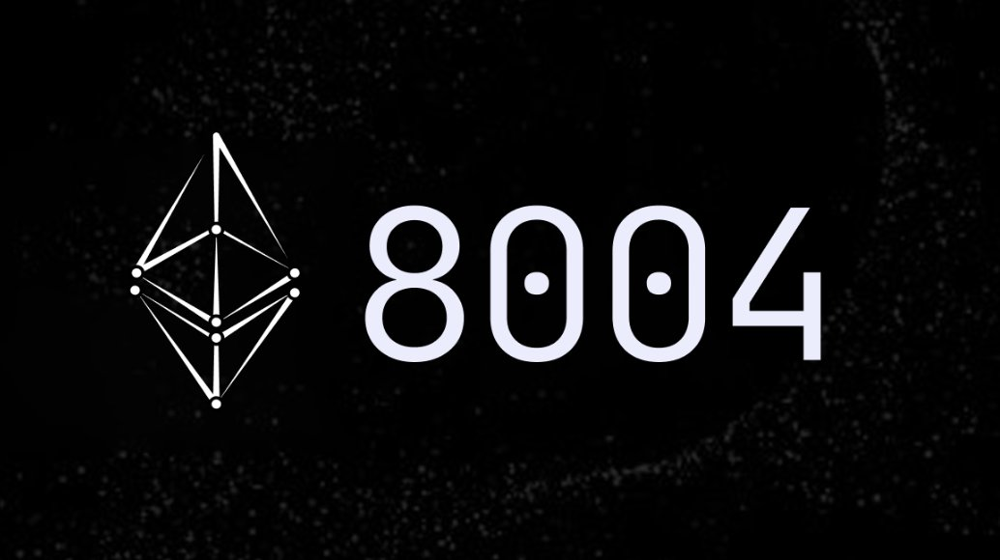

<div align="center">
  
  
  # Awesome ERC-8004
  
  <p><strong>A curated list of awesome resources for ERC-8004: Trustless Agents</strong></p>
</div>

---

## 🚀 Quick Start

ERC-8004 is an Ethereum standard that extends the Agent-to-Agent (A2A) Protocol with a trust layer, enabling participants to discover, choose, and interact with agents across organizational boundaries without pre-existing trust. The protocol introduces three lightweight, on-chain registries for identity, reputation, and validation.

**New to ERC-8004?** Start with:

- 📖 [What is ERC-8004?](#what-is-erc-8004)
- 🔍 [Core Components](#core-components)
- 💡 [FAQ](#faq)
- 🛠️ [Getting Started for Developers](#development-resources)

---

## 📋 Table of Contents

### 🎯 Getting Started

- [🚀 Quick Start](#-quick-start)
- [❓ What is ERC-8004?](#-what-is-erc-8004)
- [💡 FAQ](#-faq)

### 📚 Official Resources

- [📖 Official Documentation](#-official-documentation)
- [📄 Specification](#-specification)
- [🏛️ Standards & References](#-standards--references)

### 👥 Community & Projects

- [🌟 Active Builder Projects](#-active-builder-projects)
- [📹 Community Calls & Content](#-community-calls--content)
- [💬 Discussions & Forums](#-discussions--forums)

### 🔧 Development

- [🛠️ Development Resources](#-development-resources)
- [📋 Smart Contract Interfaces](#-smart-contract-interfaces)
- [🔗 Related Standards](#-related-standards)

### 📊 Research & Resources

- [🔬 Research & Papers](#-research--papers)
- [🤝 Contributing](#-contributing)

---

## ❓ What is ERC-8004?

ERC-8004 introduces **three lightweight, on-chain registries** that enable trustless agent interactions:

### Core Components

| Registry                | Purpose                                | Details                                  |
| ----------------------- | -------------------------------------- | ---------------------------------------- |
| **Identity Registry**   | Agent discovery & portable identifiers | ERC-721 with URIStorage                  |
| **Reputation Registry** | Feedback & attestation system          | Standard interface for scores & metadata |
| **Validation Registry** | Independent verification hooks         | Generic validation framework             |

### 🎯 Key Benefits

- **🔍 Cross-organizational Discovery** - Find agents without pre-existing relationships
- **🔌 Flexible Endpoints** - Support for A2A, MCP, ENS, DIDs, and wallet addresses
- **⚖️ Modular Trust** - Pluggable trust models from low-stake to high-stake interactions
- **🔗 On-chain Composability** - Smart contracts can read reputation and validation data
- **⚡ Gas Efficient** - Off-chain data storage with on-chain integrity
- **🛡️ Standard Compliant** - Full ERC-721 compatibility for NFT marketplace integration

### 🔐 Trust Models Supported

1. **Reputation-based** - Client feedback with scores (0-100), tags, and metadata
2. **Crypto-economic** - Stake-secured validation with economic incentives
3. **Crypto-verification** - TEE attestations and zkML proofs for cryptographic trust

## 📖 Official Resources

- **[ERC-8004 Official Website](http://8004.org)** - Official website for ERC-8004: Trustless Agents
- **[EIP-8004 Specification](https://eips.ethereum.org/EIPS/eip-8004)** - Official Ethereum Improvement Proposal
- **[A2A Protocol Specification](https://a2a-protocol.org/latest/specification/)** - Agent-to-Agent Protocol that ERC-8004 extends

## 📄 Specification

### 📊 Current Status

- **Status**: Peer Review
- **Version**: v1 Complete
- **Registries**: 3 operational (Identity, Reputation, Validation)
- **Community**: Active builder ecosystem with implementations

### 🏗️ Architecture Overview

```
┌─────────────────┐
│ 🔍 Agent        │
│    Discovery    │
└────────┬────────┘
         │
         ▼
┌─────────────────┐
│ 🏛️ Identity     │
│    Registry     │
└────────┬────────┘
         │
         ▼
┌─────────────────┐
│ 📝 Agent        │
│   Registration  │
└────┬───────┬────┘
     │       │
     ▼       ▼
┌─────────┐ ┌─────────────┐
│ ⭐ Rep. │ │ ✅ Valid.   │
│ Registry│ │  Registry   │
└────┬────┘ └──────┬──────┘
     │             │
     └──────┬──────┘
            ▼
    ┌─────────────────┐
    │ 🔐 Trust        │
    │   Assessment    │
    └────────┬────────┘
             │
             ▼
    ┌─────────────────┐
    │ 🤝 Agent        │
    │   Interaction   │
    └─────────────────┘
```

### 📋 Agent Registration Schema

```json
{
  "type": "https://eips.ethereum.org/EIPS/eip-8004#registration-v1",
  "name": "myAgentName",
  "description": "A natural language description of the Agent...",
  "image": "https://example.com/agentimage.png",
  "endpoints": [
    {
      "name": "A2A",
      "endpoint": "https://agent.example/.well-known/agent-card.json",
      "version": "0.3.0"
    },
    {
      "name": "MCP",
      "endpoint": "https://mcp.agent.eth/",
      "version": "2025-06-18"
    }
  ],
  "supportedTrust": ["reputation", "crypto-economic", "tee-attestation"]
}
```

## 📹 Community Calls & Content

### 🎥 Recorded Sessions

- **[Trustless Agents Call #1 - September 23, 2025](https://youtu.be/kooO3DGzYek)** - First community call with demos and roadmap updates
- **[Community Call #1 Slides](https://docs.google.com/presentation/d/1DUAl2MxHw0J5jSr7Ap5eCCzNLMSbCQ3LcCZyFMNm3Y4/edit?usp=sharing)** - Presentation slides from September 23, 2025 call
- **[Trustless Agents Call #2](https://www.youtube.com/watch?v=J3PkdQEZWK0)** - Second community call recording

### 🎪 Events & Conferences

- **[Trustless Agents Day - Devconnect](https://devconnect.org/calendar?event=trustlessagentsday)** - Full-day summit at Devconnect exploring Ethereum as coordination layer for AI economy (November 21, 2025)

---

## 🌟 Active Builder Projects

### 🚀 Infrastructure & SDKs

**[Automata Network](https://www.ata.network/)**

- [Automata DCAP Attestation](https://github.com/automata-network/automata-dcap-attestation) - Solidity library for onchain Intel SGX and TDX attestation verification, supporting RISC Zero and Succinct
- [Intel TDX Attestation SDK](https://github.com/automata-network/tdx-attestation-sdk) - SDK for generating Intel TDX quotes across cloud providers with ZK proof generation
- [AMD SEV-SNP Attestation SDK](https://github.com/automata-network/amd-sev-snp-attestation-sdk) - SDK for AMD SEV-SNP attestation reports with ZK proof support
- [AWS Nitro Enclave Attestation](https://github.com/automata-network/aws-nitro-enclave-attestation) - CLI for AWS Nitro Enclave attestation
- [Automata SGX SDK](https://github.com/automata-network/automata-sgx-sdk) - Rust-native SDK for Intel SGX secure enclave development

**[Praxis Protocol](https://twitter.com/Praxis_Protocol)**

- [Praxis Python SDK](https://github.com/prxs-ai/praxis-py-sdk)
- [Praxis Go SDK](https://github.com/prxs-ai/praxis-go-sdk)

**[Ch40s Chain](https://twitter.com/Ch40sChain)**

- [Reference Implementation for ERC-8004](https://github.com/ChaosChain/trustless-agents-erc-ri)
- [Chaos Chain SDK for building autonomous agents](https://docs.chaoscha.in/sdk/installation)
- [Genesis Studio - Commercial prototype for ERC8004](https://github.com/ChaosChain/chaoschain-genesis-studio)

**[Vistara Labs](https://x.com/vistaralabs)**

- [Vistara Agent Arena SDK](https://github.com/vistara-apps/agent-arena-v1)
- [ERC-8004 Example](https://github.com/vistara-apps/erc-8004-example)

### 🤝 Collaboration Frameworks

**[Ensemble Framework](https://x.com/EnsembleCodes)**

- [Ensemble Docs](https://docs.ensemble.codes)

**[ISEK](https://x.com/ISEK_Official)**

- [ISEK Decentralized agent network](https://github.com/isekOS/ISEK)
- [Awesome A2A agents](https://github.com/isekOS/awesome-a2a-agents)

### 🔐 Security & Verification

**[Phala Network](https://twitter.com/PhalaNetwork)**

- [Deploy ERC-8004 Agent in a TEE](https://github.com/Dstack-TEE/dstack)
- [TEE based ERC-8004 implementation](https://github.com/HashWarlock/erc-8004-ex-phala/)

**[Sparsity](https://twitter.com/sparsity_xyz)**

- [ERC-8004 AI agent demo](https://github.com/sparsity-xyz/sparsity-demo)

### 🪪 Identity & Trust

**[Chitin](https://chitin.id)**

- [Chitin Soul Registry](https://github.com/EijiAC24/Chitin) - Soul identity layer for AI agents on Base L2. Uses ERC-8004 `register()` for agent passports + Soulbound Tokens (EIP-5192) as permanent soul certificates. Includes W3C DID resolution, on-chain certificates, multi-method governance voting, and A2A readiness verification. Live on Base Mainnet.
- [Chitin MCP Server](https://www.npmjs.com/package/chitin-mcp-server) - MCP server for AI assistants to verify agent identities, resolve DIDs, and manage certificates (`npx chitin-mcp-server`)

### 🎮 Applications & Demos

**[Cotten IO (Scypted)](https://twitter.com/CottenIO)**

**Community Projects**

- **[TrustlessAgents](https://github.com/CasualHackathon/TrustlessAgents)** - Community hackathon project implementing ERC-8004
- **[8004 Implementation](https://github.com/zpaynow/8004)** - Community-driven ERC-8004 implementation

### 🎓 Educational Resources

- **[Trustless Agents Course](https://intensivecolearn.ing/en/programs/trustless-agents)** - Comprehensive course on trustless agents and ERC-8004
- **[Sparsity AI Workshop](https://www.youtube.com/watch?v=jqOZj399BLE)** - Build an ERC-8004 Trustless Agent with TEE

## 💬 Discussions & Forums

### 🏛️ Official Channels

- **[Ethereum Magicians Discussion](https://ethereum-magicians.org/t/erc-8004-trustless-agents/25098)** - Official discussion thread for ERC-8004
- **[GitHub Issues](https://github.com/ethereum/ERCs/pull/1170)** - Technical discussions and feedback on the specification

### 👥 Community Groups

- **[ERC-8004 Telegram Group](http://t.me/ERC8004)** - Official builder community and discussion group

---

## 🔬 Research & Papers

> 📚 Academic papers and research related to trustless agents and ERC-8004

_This section is currently being populated. Contribute research papers and academic work!_

## 🛠️ Development Resources

### 🎯 Getting Started for Developers

1. **Read the [EIP-8004 Specification](https://eips.ethereum.org/EIPS/eip-8004)**
2. **Join the [Builder Program](http://bit.ly/8004builderprogram)**
3. **Check out [Reference Implementations](#-active-builder-projects)**
4. **Review [Contract Deployments](#-contract-deployments)**
5. **Join the [Developer Community](http://t.me/ERC8004)**

### 🏗️ Contract Deployments

**Official Implementation:** [erc-8004/erc-8004-contracts](https://github.com/erc-8004/erc-8004-contracts)

The reference implementation contracts are deployed on multiple testnets including Ethereum Sepolia, Base Sepolia, Linea Sepolia, and Hedera Testnet. Complete deployment addresses and supported networks are available in the contracts repository.

**Mainnet Status:**

- **Planned Release:** End of October 2025
- **Target Networks:** Major L2s and EVM-compatible L1s
- **Governance:** Multi-signature governance structure
- **Governance Contact:** [davide.crapis@ethereum.org](mailto:davide.crapis@ethereum.org)

### 🛠️ SDKs and Libraries

#### JavaScript/TypeScript

- **[ChaosChain SDK](https://github.com/ChaosChain/chaoschain/tree/main/packages/sdk)** - Full-featured JavaScript/TypeScript SDK
- **[erc-8004-js](https://github.com/tetratorus/erc-8004-js)** - Lightweight JavaScript library

#### Python

- **[erc-8004-py](https://github.com/tetratorus/erc-8004-py)** - Python implementation
- **[chaoschain-sdk](https://pypi.org/project/chaoschain-sdk/)** - Available on PyPI

---

## 📋 Smart Contract Interfaces

### 🏛️ Identity Registry (ERC-721 Compatible)

```solidity
// Register new agent
function register(string tokenURI, MetadataEntry[] calldata metadata)
    returns (uint256 agentId)

// Manage metadata
function setMetadata(uint256 agentId, string key, bytes value)
function getMetadata(uint256 agentId, string key) returns (bytes)
```

### ⭐ Reputation Registry

```solidity
// Give feedback (requires agent signature)
function giveFeedback(
    uint256 agentId,
    uint8 score,
    bytes32 tag1,
    bytes32 tag2,
    string fileuri,
    bytes32 filehash,
    bytes feedbackAuth
)

// Query reputation
function getSummary(
    uint256 agentId,
    address[] clientAddresses,
    bytes32 tag1,
    bytes32 tag2
) returns (uint64 count, uint8 averageScore)
```

### ✅ Validation Registry

```solidity
// Request validation
function validationRequest(
    address validatorAddress,
    uint256 agentId,
    string requestUri,
    bytes32 requestHash
)

// Provide validation response
function validationResponse(
    bytes32 requestHash,
    uint8 response,
    string responseUri,
    bytes32 responseHash,
    bytes32 tag
)
```

---

## 🏛️ Standards & References

### 📜 Core Standards

- **[CAIP-10](https://github.com/ChainAgnostic/CAIPs/blob/main/CAIPs/caip-10.md)** - Chain Agnostic Improvement Proposal for account identification
- **[RFC 8615](https://www.rfc-editor.org/rfc/rfc8615)** - Well-Known URIs specification
- **[RFC 7071](https://datatracker.ietf.org/doc/html/rfc7071)** - A Media Type for Reputation Interchange (Reputons)
- **[ERC-721](https://eips.ethereum.org/EIPS/eip-721)** - Non-Fungible Token Standard (base for Identity Registry)

### 🔗 Related Services

- **[EAS (Ethereum Attestation Service)](https://attest.org/)** - Referenced for on-chain attestations

## 🔗 Related Standards

### 🌐 Ethereum Ecosystem

- **[ERC-8001](https://github.com/ethereum/ERCs/issues/XXX)** - Agent-to-Agent coordination (mentioned in discussions)
- **[EAS](https://attest.org/)** - Ethereum Attestation Service for on-chain attestations

### 🤝 External Protocols

- **[A2A Protocol](https://a2a-protocol.org/)** - Agent-to-Agent Protocol that ERC-8004 extends
- **[x402 Payment Standard](https://www.x402.org/)** - Referenced for potential payment integration

## 💡 FAQ

<details>
<summary><strong>🔍 What is ERC-8004 and how does it relate to the A2A Protocol?</strong></summary>

ERC-8004 extends the Agent-to-Agent (A2A) Protocol with a **trust layer** that allows participants to discover, choose, and interact with agents across organizational boundaries without pre-existing trust. It introduces three lightweight, on-chain registries—Identity, Reputation, and Validation—while leaving application-specific logic to off-chain components.

</details>

<details>
<summary><strong>🏗️ What are the three core components of ERC-8004?</strong></summary>

The three registries are:

1. **Identity Registry** - Minimal on-chain handle that resolves to an agent's off-chain AgentCard
2. **Reputation Registry** - Standard interface for posting and fetching attestations
3. **Validation Registry** - Generic hooks for requesting and recording independent checks
</details>

<details>
<summary><strong>🔐 What trust models does ERC-8004 support?</strong></summary>

ERC-8004 supports three pluggable trust models:

- **Reputation-based systems** using client feedback
- **Stake-secured inference validation** (crypto-economics)
- **TEE attestations** for agents running in Trusted Execution Environments (crypto-verifiability)
</details>

### 📊 Specification Status

<details>
<summary><strong>📋 What is the current status of the ERC-8004 specification?</strong></summary>

ERC-8004 is in **peer review status** with a complete specification available. The protocol includes three operational registries (Identity, Reputation, and Validation) and has strong community support with builders actively developing implementations.

</details>

<details>
<summary><strong>✅ What does ERC-8004 v1 include?</strong></summary>

The current specification includes:

- ✅ Complete smart contract interfaces for all three registries
- ✅ ERC-721 compatible Identity Registry with metadata support
- ✅ Comprehensive feedback system with on-chain scoring (0-100) and off-chain metadata
- ✅ Validation framework supporting crypto-economic and crypto-verification models
- ✅ Full compatibility with A2A Protocol and MCP endpoints
- ✅ Deployment-ready smart contract specifications
</details>

### 🔧 Technical Implementation

<details>
<summary><strong>⚡ Why does ERC-8004 prioritize off-chain data storage over on-chain?</strong></summary>

The protocol deliberately keeps complex data off-chain for several reasons:

- **Gas efficiency** - Avoids requiring agents to sign transactions for each feedback
- **Scalability** - Enables sophisticated reputation algorithms and aggregation services
- **Flexibility** - Allows for custom validation protocols with their own incentive mechanisms
- **Aggregation focus** - Single feedback/validation entries are rarely used alone; they're typically aggregated
</details>

<details>
<summary><strong>🔗 Should validation and reputation data be stored on-chain for smart contract composability?</strong></summary>

This is an active debate in the community. Arguments for on-chain storage include:

- Enabling smart contracts to read validation responses and condition logic on them
- Decoupling validation from enforcement (validators focus on validation, other protocols handle slashing)
- Supporting permissionless innovation by other developers

The current specification keeps data off-chain but emits events, though some suggest making on-chain storage optional.

</details>

<details>
<summary><strong>🌐 How does domain validation work in the Identity Registry?</strong></summary>

Currently, the ERC doesn't specify how to verify that an agent actually owns the domain they claim. This verification is left to users of the protocol. Future versions might include:

- Trusted party verification
- Consensus/verification mechanisms (e.g., zkTLS proofs)
- Allowing multiple agents to claim the same domain with disambiguation
</details>

<details>
<summary><strong>🔗 Why does ERC-8004 require agents to use domains instead of URLs?</strong></summary>

The current specification requires each agent to have its own domain/subdomain with AgentCard at the well-known location `/.well-known/agent-card.json`. This is stricter than the A2A spec, which allows URLs. Some community members suggest using URLs instead to allow multiple agents per domain.

</details>

### ⭐ Reputation and Trust

<details>
<summary><strong>📊 Should reputation be a single aggregate score or modular?</strong></summary>

The community strongly favors **modular approaches**:

- ❌ **Against single scores**: Creates monopolistic behavior and oversimplifies trust relationships
- ✅ **For modularity**: Trust is context-dependent and varies between agent pairs
- 🎯 **Preferred approach**: Index and reference multiple reputation systems, allowing agents to choose relevant metrics
</details>

<details>
<summary><strong>🤝 How should reputation providers work together?</strong></summary>

Community suggestions include:

- Multiple providers (e.g., Virtuals, Creatorbid, Base) offering scores for agents
- (Agent, Provider) pairs in the registry for on-chain applications
- Reducing bias and collusion risk through multiple score sources
- Individual attestation history remaining standalone
</details>

<details>
<summary><strong>🔄 Is trust universal between agents?</strong></summary>

**No.** Trust is not a universal value but a **vector** from one agent to another. Alice's trust for Bob will differ from Charlie's trust for Bob, and Alice's trust varies by context/domain of interaction. This reinforces the need for modular, context-aware reputation systems.

</details>

### 💰 Payment and Economics

<details>
<summary><strong>💳 How does ERC-8004 handle payments between agents?</strong></summary>

ERC-8004 deliberately **doesn't cover payments** to remain unopinionated and avoid coupling trust/discovery with specific payment protocols. However:

- Payment proofs can be included as optional attributes in off-chain schemas
- The team is collaborating with groups working on A2A payment extensions based on x402
- Payment references should be lightweight hooks in Reputation records for correlation
</details>

<details>
<summary><strong>🔄 What payment mechanisms are envisioned?</strong></summary>

While payments are orthogonal to ERC-8004, the specification provides examples showing how x402 payment proofs can enrich feedback signals:

```json
{
  "proof_of_payment": {
    "fromAddress": "0x00...",
    "toAddress": "0x00...",
    "chainId": "1",
    "txHash": "0x00..."
  }
}
```

Other potential mechanisms include:

- Time locks and predetermined arbitration
- Staking by buyer or seller
- Escrow systems with crypto-economic guarantees
- Integration with A2A payment extensions based on x402
</details>

<details>
<summary><strong>🎯 Should there be incentives for providing feedback or guaranteeing data availability?</strong></summary>

This is mentioned as a possible future direction, including:

- Incentives to provide feedback
- Guarantees for off-chain data availability of feedback and validations
- Crypto-economic mechanisms for validator honesty
</details>

### ✅ Validation and Verification

<details>
<summary><strong>🔍 How do the two validation scenarios work?</strong></summary>

- **Crypto-economic scenario**: DataHash commits to job re-execution info; AgentValidator can be trusted agents, committees, or stake-secured services
- **Crypto-verification scenario**: DataHash commits to TEE attestation/zkTLS proof info; AgentValidator is a verifier smart contract checking proofs on-chain
</details>

<details>
<summary><strong>🔗 What's the relationship between ERC-8004 and other agent standards?</strong></summary>

- **ERC-8001**: Focuses on agent-to-agent coordination and consensus (orthogonal to ERC-8004)
- **EAS**: Referenced for on-chain attestations
- **RFC 7071 (Reputons)**: Standard for reputation interchange, relevant for reputation systems
</details>

### 🚀 Implementation and Development

<details>
<summary><strong>🏛️ Will there be a single registry per chain or multiple registries?</strong></summary>

The goal is to have **one singleton Identity Registry per chain** to prevent proliferation of slightly different registries.

</details>

<details>
<summary><strong>💰 Should registration be free or require deposits?</strong></summary>

This implementation detail isn't specified in the current ERC but is under discussion for future versions.

</details>

<details>
<summary><strong>📋 How detailed are the smart contract interfaces?</strong></summary>

The current ERC provides function names and parameters but lacks detailed Solidity interfaces. Future versions will include more precise type specifications and complete interface definitions.

</details>

<details>
<summary><strong>🌉 What about cross-chain support?</strong></summary>

Cross-chain identifiers are mentioned as a possible future direction, along with:

- NFT interfaces for agent minting, ownership, and transfer
- ENS support
- Integrations with A2A payment extensions
</details>

### 🌐 Integration and Ecosystem

<details>
<summary><strong>🔌 How does ERC-8004 integrate with existing projects?</strong></summary>

Several projects are already building compatible systems:

- **Ensemble Framework**: Building trustless layer for agent collaboration
- **CoopHive Alkahest**: Smart contracts for peer-to-peer escrowed exchange
- Various reputation and validation service providers
</details>

<details>
<summary><strong>🏗️ What standards does ERC-8004 build upon?</strong></summary>

Key standards include:

- **CAIP-10**: Chain-agnostic account identification
- **RFC 8615**: Well-Known URIs specification
- **A2A Protocol**: Base agent-to-agent communication
- **EAS**: Ethereum Attestation Service patterns
</details>

## 🤝 Contributing

We welcome contributions to this awesome list!

### 📝 What to Contribute

- 🔧 Implementations of ERC-8004
- 🛠️ Tools and libraries for developers
- 📚 Documentation and tutorials
- 🔬 Research papers and academic work
- 🚀 Community projects using ERC-8004
- 💬 Discussion summaries and insights

### 🔄 How to Contribute

1. Check the [issues](https://github.com/sudeepb02/awesome-erc8004/issues) for ongoing discussions
2. Fork this repository
3. Add your resource to the appropriate section
4. Submit a pull request with a clear description
5. Follow the [Awesome List Guidelines](https://github.com/sindresorhus/awesome/blob/main/contributing.md)

📖 **See [Contributing Guidelines](CONTRIBUTING.md) for detailed instructions.**

---

## 🙏 Acknowledgments

### 👨‍💻 Core Authors & Contributors

- **Marco De Rossi** [@marco_derossi](https://x.com/marco_derossi) (MetaMask)
- **Davide Crapis** [@dcrapis](https://x.com/DavideCrapis) (Ethereum Foundation)
- **Jordan Ellis** (Google)
- **Erik Reppel** (Coinbase)

### 🏢 Contributing Organizations

- **Ethereum Foundation's dAI team** - Core protocol development and research
- **Consensys** - Implementation and ecosystem development
- **Builder Community** - Active development and technical feedback

### 🌟 Community

And to all the community members providing feedback and technical contributions to the ecosystem.

---

<div align="center">

## 📄 License

[](https://creativecommons.org/publicdomain/zero/1.0/)

To the extent possible under law, the contributors have waived all copyright and related or neighboring rights to this work.

---

<p><em>Made with ❤️ by the ERC-8004 community</em></p>

</div>
