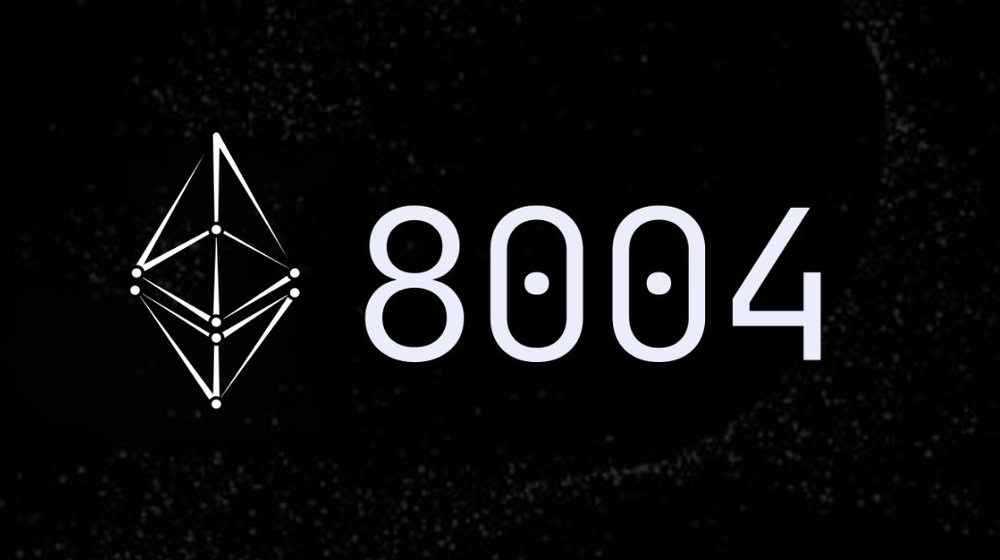

<div align="center">
  
  
  # Awesome ERC-8004
  
  <p><strong>A curated list of awesome resources for ERC-8004: Trustless Agents</strong></p>
</div>

---

## Table of Contents

- [What is ERC-8004?](#what-is-erc-8004)
- [Official Resources](#official-resources)
- [Specification](#specification)
- [Community Calls & Content](#community-calls--content)
- [Builder Projects](#builder-projects)
- [Discussions & Forums](#discussions--forums)
- [Research & Papers](#research--papers)
- [Explorer & Scanner Tools](#explorer--scanner-tools)
- [Development Resources](#development-resources)
- [Smart Contract Interfaces](#smart-contract-interfaces)
- [Standards & References](#standards--references)
- [Related Standards](#related-standards)
- [FAQ](#faq)

---

## What is ERC-8004?

ERC-8004 is an Ethereum standard that extends the Agent-to-Agent (A2A) Protocol with a trust layer, enabling participants to discover, choose, and interact with agents across organizational boundaries without pre-existing trust. It introduces three lightweight, on-chain registries:

### Core Components

| Registry                | Purpose                                | Details                                  |
| ----------------------- | -------------------------------------- | ---------------------------------------- |
| **Identity Registry**   | Agent discovery & portable identifiers | ERC-721 with URIStorage                  |
| **Reputation Registry** | Feedback & attestation system          | Standard interface for scores & metadata |
| **Validation Registry** | Independent verification hooks         | Generic validation framework             |

### Key Properties

- **Cross-organizational Discovery** - Agents can be found without pre-existing relationships
- **Flexible Endpoints** - Support for A2A, MCP, ENS, DIDs, and wallet addresses
- **Modular Trust** - Pluggable trust models from low-stake to high-stake interactions
- **On-chain Composability** - Smart contracts can read reputation and validation data
- **Gas Efficiency** - Off-chain data storage with on-chain integrity
- **ERC-721 Compatibility** - Full compatibility for NFT marketplace integration

### Trust Models

1. **Reputation-based** - Client feedback using signed fixed-point values, tags, and metadata
2. **Crypto-economic** - Stake-secured validation with economic incentives
3. **Crypto-verification** - TEE attestations and zkML proofs for cryptographic trust

## Official Resources

- **[ERC-8004 Official Website](http://8004.org)** - Official website for ERC-8004: Trustless Agents
- **[EIP-8004 Specification](https://eips.ethereum.org/EIPS/eip-8004)** - Official Ethereum Improvement Proposal
- **[ERC8004SPEC.md](https://github.com/erc-8004/erc-8004-contracts/blob/master/ERC8004SPEC.md)** - Specification file in the contracts repository
- **[ERC-8004 Best Practices](https://github.com/erc-8004/best-practices)** - Official guides covering agent registration (`Registration.md`) and reputation usage (`Reputation.md`)
- **[8004.org/build](https://www.8004.org/build)** - Developer hub with tools, SDKs, and integration resources
- **[8004.org Blog](https://www.8004.org/blog)** - Official blog
- **[A2A Protocol Specification](https://a2a-protocol.org/latest/specification/)** - Agent-to-Agent Protocol that ERC-8004 extends

## Specification

### Current Status

- **Status**: Draft (EIP process), contracts are audited and final
- **Registries**: Identity and Reputation final contracts deployed; Validation Registry under active revision
- **Specification**: [ERC8004SPEC.md](https://github.com/erc-8004/erc-8004-contracts/blob/master/ERC8004SPEC.md) in the contracts repository

### Architecture Overview

```
┌─────────────────┐
│ Agent           │
│ Discovery       │
└────────┬────────┘
         │
         ▼
┌─────────────────┐
│ Identity        │
│ Registry        │
└────────┬────────┘
         │
         ▼
┌─────────────────┐
│ Agent           │
│ Registration    │
└────┬───────┬────┘
     │       │
     ▼       ▼
┌─────────┐ ┌─────────────┐
│ Rep.    │ │ Validation  │
│ Registry│ │ Registry    │
└────┬────┘ └──────┬──────┘
     │             │
     └──────┬──────┘
            ▼
    ┌─────────────────┐
    │ Trust           │
    │ Assessment      │
    └────────┬────────┘
             │
             ▼
    ┌─────────────────┐
    │ Agent           │
    │ Interaction     │
    └─────────────────┘
```

### Agent Registration Schema

```json
{
  "type": "https://eips.ethereum.org/EIPS/eip-8004#registration-v1",
  "name": "myAgentName",
  "description": "A natural language description of the Agent...",
  "image": "https://example.com/agentimage.png",
  "services": [
    {
      "name": "web",
      "endpoint": "https://web.agentxyz.com/"
    },
    {
      "name": "A2A",
      "endpoint": "https://agent.example/.well-known/agent-card.json",
      "version": "0.3.0"
    },
    {
      "name": "MCP",
      "endpoint": "https://mcp.agent.eth/",
      "version": "2025-06-18"
    },
    {
      "name": "OASF",
      "endpoint": "ipfs://{cid}",
      "version": "0.8",
      "skills": [],
      "domains": []
    },
    {
      "name": "ENS",
      "endpoint": "agent.eth",
      "version": "v1"
    },
    {
      "name": "DID",
      "endpoint": "did:method:foobar",
      "version": "v1"
    },
    {
      "name": "email",
      "endpoint": "mail@myagent.com"
    }
  ],
  "x402Support": false,
  "active": true,
  "registrations": [
    {
      "agentId": 22,
      "agentRegistry": "{namespace}:{chainId}:{identityRegistry}"
    }
  ],
  "supportedTrust": ["reputation", "crypto-economic", "tee-attestation"]
}
```

The `type`, `name`, `description`, and `image` fields ensure compatibility with ERC-721 apps. The `services` list is fully customizable. The `supportedTrust` field is optional; if absent, the registration is used for discovery only.

## Community Calls & Content

### Recorded Sessions

- **[Trustless Agents Call #1 - September 23, 2025](https://youtu.be/kooO3DGzYek)** - First community call with demos and roadmap updates
- **[Community Call #1 Slides](https://docs.google.com/presentation/d/1DUAl2MxHw0J5jSr7Ap5eCCzNLMSbCQ3LcCZyFMNm3Y4/edit?usp=sharing)** - Presentation slides from September 23, 2025 call
- **[Trustless Agents Call #2](https://www.youtube.com/watch?v=J3PkdQEZWK0)** - Second community call recording

### Events & Conferences

- **[Trustless Agents Day - Devconnect](https://devconnect.org/calendar?event=trustlessagentsday)** - Full-day summit at Devconnect exploring Ethereum as coordination layer for AI economy (November 21, 2025)
- **[8004 Community Call #3](https://lu.ma/2kvxberc)** - Third community call (November 12, 2025)
- **[Builder Nights Denver](https://lu.ma/bndenver)** - In-person builder event in Denver (February 17, 2026)
- **[Agentic Brunch - ERC-8004](https://lu.ma/j57z0k64)** - Community brunch event (February 25, 2026)
- **[8004 Launch Day](https://lu.ma/658en7zs)** - Official mainnet launch event (March 17, 2026)

---

## Builder Projects

### Infrastructure & SDKs

**[UFX Agentic Commerce](https://github.com/ufosearchspace-create/ERC8183)**

- [ERC-8183 Hook & Reputation Middleware](https://github.com/ufosearchspace-create/ERC8183) - First `IACPHook` implementations and ERC-8004 reputation bridge for ERC-8183 (Agentic Commerce Protocol). Includes ReputationHook (auto-writes job outcomes to ReputationRegistry), ReputationGateHook (reputation-based funding gate), SLAHook (deadline enforcement), AI evaluators, and Python SDK. 208 Solidity tests (incl. 9 fuzz). Live on Base Mainnet with [Iamalive Agent #1734](https://basescan.org/address/0x3F41E8699D774Eb738967A6506B3A9E919aA1c8B). MIT licensed.

**[Automata Network](https://www.ata.network/)**

- [Automata DCAP Attestation](https://github.com/automata-network/automata-dcap-attestation) - Solidity library for onchain Intel SGX and TDX attestation verification, supporting RISC Zero and Succinct
- [Intel TDX Attestation SDK](https://github.com/automata-network/tdx-attestation-sdk) - SDK for generating Intel TDX quotes across cloud providers with ZK proof generation
- [AMD SEV-SNP Attestation SDK](https://github.com/automata-network/amd-sev-snp-attestation-sdk) - SDK for AMD SEV-SNP attestation reports with ZK proof support
- [AWS Nitro Enclave Attestation](https://github.com/automata-network/aws-nitro-enclave-attestation) - CLI for AWS Nitro Enclave attestation
- [Automata SGX SDK](https://github.com/automata-network/automata-sgx-sdk) - Rust-native SDK for Intel SGX secure enclave development

**[Praxis Protocol](https://twitter.com/Praxis_Protocol)**

- [Praxis Python SDK](https://github.com/prxs-ai/praxis-py-sdk)
- [Praxis Go SDK](https://github.com/prxs-ai/praxis-go-sdk)

**[Ch40s Chain](https://twitter.com/Ch40sChain)**

- [Reference Implementation for ERC-8004](https://github.com/ChaosChain/trustless-agents-erc-ri)
- [Chaos Chain SDK for building autonomous agents](https://docs.chaoscha.in/sdk/installation)
- [Genesis Studio - Commercial prototype for ERC8004](https://github.com/ChaosChain/chaoschain-genesis-studio)

**[Vistara Labs](https://x.com/vistaralabs)**

- [Vistara Agent Arena SDK](https://github.com/vistara-apps/agent-arena-v1)
- [ERC-8004 Example](https://github.com/vistara-apps/erc-8004-example)
- **[Verity Protocol](https://verity.tenpound.xyz)** — On-chain reliability scoring for ERC-8004 agents. Indexes `NewFeedback` events from the `ReputationRegistry`, computes Brier Skill Scores across Economic, Solver, and Governance verticals, submits reputation back via `giveFeedback` after each scoring cycle, and anchors every score as an EAS attestation on Base. SDK: [`@veritynpm/sdk`](https://www.npmjs.com/package/@veritynpm/sdk).

### Collaboration Frameworks

### Commerce & Escrow

**[UFX Agentic Commerce](https://github.com/ufosearchspace-create/ERC8183)** — First `IACPHook` implementations and ERC-8004 reputation bridge for ERC-8183 (Agentic Commerce Protocol). The EIP defines hooks; we built and deployed them.

- [ReputationHook](https://github.com/ufosearchspace-create/ERC8183) - Auto-writes job outcomes to ERC-8004 ReputationRegistry after every completed/rejected job
- [ReputationGateHook](https://github.com/ufosearchspace-create/ERC8183) - Gates provider funding by ERC-8004 reputation score and job history
- [SLAHook](https://github.com/ufosearchspace-create/ERC8183) - Enforces submission deadlines after funding
- [WebScrapingEvaluator + AI Evaluator](https://github.com/ufosearchspace-create/ERC8183) - On-chain attestation for deliverables
- [Python SDK](https://github.com/ufosearchspace-create/ERC8183) - Async client for contract interaction
- 208 Solidity tests (incl. 9 fuzz). 5 verified contracts on Base Mainnet. [Iamalive Agent #1734](https://basescan.org/address/0x3F41E8699D774Eb738967A6506B3A9E919aA1c8B). MIT licensed.

**[Azeth](https://azeth.ai)** 

Trust infrastructure for the machine economy. TypeScript SDK suite providing ERC-8004 identity registration, weighted reputation with Sybil-resistant opinions, capability-based service discovery, and x402 payment settlement with automatic reputation feedback. Agents get non-custodial ERC-4337 smart accounts with guardian-enforced guardrails. Deployed on Base Sepolia and Ethereum Sepolia with deterministic CREATE2 addresses.

- [Azeth SDK (`@azeth/sdk`)](https://www.npmjs.com/package/@azeth/sdk) - Smart account creation, ERC-8004 registry operations, x402 payments, and XMTP messaging
- [Azeth MCP Server (`@azeth/mcp-server`)](https://www.npmjs.com/package/@azeth/mcp-server) - MCP tools for AI agents to create accounts, discover services, pay, and submit reputation
- [Azeth Provider (`@azeth/provider`)](https://www.npmjs.com/package/@azeth/provider) - x402 service provider middleware for Hono with on-chain USDC settlement
- [Azeth CLI (`@azeth/cli`)](https://www.npmjs.com/package/@azeth/cli) - Command-line interface for registry and payment operations
- [Azeth Common (`@azeth/common`)](https://www.npmjs.com/package/@azeth/common) - Shared types, ABIs, and contract addresses

### Verification & Identity

**[ORIGIN Protocol](https://origindao.ai)** — _Proof of Agency: Cognitive verification for AI agents_

- [ORIGIN Registry (Base Mainnet)](https://basescan.org/address/0xac62E9d0bE9b88674f7adf38821F6e8BAA0e59b0) - ERC-8004 compatible soulbound Birth Certificate registry
- [ERC-8004 Adapter (Base Mainnet)](https://basescan.org/address/0x1802e68168a66ACFc2d052a6aDE11a22101443CA) - Adds getMetadata/setMetadata, agent wallets, services array
- [@origin-dao/sdk](https://www.npmjs.com/package/@origin-dao/sdk) - 3 lines of code to verify any agent
- [Proof of Agency Gauntlet](https://github.com/origin-dao) - 5-challenge verification: adversarial resistance, chain reasoning, memory proof, code generation, philosophical flex
- Soulbound Birth Certificates with on-chain reputation (trust levels 0→2)
- CLAMS governance token with staking rewards and fee splitting
- Genesis Mode: First 100 agents earn founding status
- First agent verified March 4, 2026 — Score: 89/100

**[M2M TRC-8004 Registry](https://m2mregistry.io)**

- [Smart Contracts (Solidity)](https://github.com/M2M-TRC8004-Registry/smart-contracts) - ERC-8004 implementation on TRON with 4 registries: Identity, Reputation, Validation, and Incident. Live on mainnet and Shasta testnet.
- [Python SDK](https://github.com/M2M-TRC8004-Registry/trc8004-m2m-sdk) - `pip install trc8004-m2m` — Async Python SDK with TronClient, RegistryAPI, and IPFS integration
- [Backend API](https://github.com/M2M-TRC8004-Registry/backend-api) - FastAPI service with event indexing, full-text search, and PostgreSQL. 332 unit tests, 97.9% coverage.

**[Ensemble Framework](https://x.com/EnsembleCodes)**

- [Ensemble Docs](https://docs.ensemble.codes)

**[ISEK](https://x.com/ISEK_Official)**

- [ISEK Decentralized agent network](https://github.com/isekOS/ISEK)
- [Awesome A2A agents](https://github.com/isekOS/awesome-a2a-agents)

### Payment Infrastructure

**[Primev](https://primev.xyz)**

- [Primev FastRPC x402 Facilitator](https://github.com/primev/mainnet-x402-facilitator) - Fee-free x402 payment facilitator on Ethereum mainnet with sub-200ms settlement via mev-commit preconfirmations. Registered as [Agent #23175](https://etherscan.io/nft/0x8004A169FB4a3325136EB29fA0ceB6D2e539a432/23175) on the Identity Registry.

### Security & Verification

**[AsterPay](https://asterpay.io)**

- [AsterPay EUR Settlement](https://asterpay.io) - EUR settlement infrastructure for x402 payments. USDC→EUR via SEPA Instant for EU/EEA businesses with MiCA compliance. Registered as [Agent #16850](https://basescan.org/nft/0x8004A169FB4a3325136EB29fA0ceB6D2e539a432/16850) on the Identity Registry. Python SDK available (`pip install asterpay`).


**[Phala Network](https://twitter.com/PhalaNetwork)**

- [Deploy ERC-8004 Agent in a TEE](https://github.com/Dstack-TEE/dstack)
- [TEE based ERC-8004 implementation](https://github.com/HashWarlock/erc-8004-ex-phala/)

**[Sparsity](https://twitter.com/sparsity_xyz)**

- [ERC-8004 AI agent demo](https://github.com/sparsity-xyz/sparsity-demo)

### Identity & Trust

### Agent Services (x402 + ERC-8004)

**[xbird](https://github.com/checkra1neth/xbird-skill)**

- [xbird MCP Server](https://www.npmjs.com/package/xbird-mcp) - Twitter/X API with 30 tools (read, search, post, engage, media upload) using x402 micropayments on Base
- [Agent Card](https://xbirdapi.up.railway.app/.well-known/agent.json) - ERC-8004 compliant agent card with x402 endpoints
- Registered on ERC-8004 Identity Registry on Base (`0x8004A169FB4a3325136EB29fA0ceB6D2e539a432`)

**[Mintware Attribution](https://mintware.finance)**

"On-chain reputation scoring for AI agents and wallets across 100+ chains. EIP-712 gasless oracle — oracle signs off-chain, agent submits on-chain. Register once, score accumulates automatically. Registered as Agent #37297 on the Base Identity Registry."

- [AIAttribution.sol (Base Mainnet)](https://basescan.org/address/0x11Ef2c7D84b755f02f3652ca8b16e6E81A96C421) - "ERC-8004 compatible on-chain agent reputation registry"
- [@mintware/ai-attribution-sdk](https://www.npmjs.com/package/@mintware/ai-attribution-sdk) - "TypeScript SDK — register, claim, query scores"
- [MCP Server](https://www.npmjs.com/package/mintware-mcp) - "4 MCP tools for Claude/Cursor"
- [Agent Leaderboard](https://mintware.finance/agents) - "Live rankings by Attribution score on Base"
- [Oracle Manifest](https://mintware.finance/.well-known/agent-reputation-oracle.json) - "RFC 8615 + ERC-8004 #37297"

**[8k4 Protocol](https://8k4protocol.com)**

- [8k4 API](https://api.8k4protocol.com) - Reputation infrastructure for ERC-8004 agents: trust scoring (IGGY-Score), metadata hosting, and cross-chain lookup. Public stats currently show 106,996 indexed agents across Base (33,939), BSC (44,020), and Ethereum (29,037), with x402 pay-per-query support (USDC on Base).

**[Helixa](https://helixa.xyz)**

- [Helixa](https://helixa.xyz) - Onchain identity and reputation protocol for AI agents on Base. 1,000+ agents minted. Features an 11-factor Cred Score system (0-100) with five tiers (JUNK → PREFERRED), SIWA (Sign-In With Agent) authentication, $CRED token staking, and agent discovery via `.well-known/ai-plugin.json`. Contract: [`0x2e3B541C59D38b84E3Bc54e977200230A204Fe60`](https://basescan.org/address/0x2e3B541C59D38b84E3Bc54e977200230A204Fe60).
- [Helixa API](https://api.helixa.xyz) - REST API for agent identity, Cred Scores, search, and staking. OpenAPI spec at `/.well-known/openapi.json`.
- [Helixa Agent Skill](https://github.com/Bendr-20/helixa) - Open-source agent skill with 13 shell scripts and reference docs for AI agents to interact with the protocol (mint, verify, query scores, stake).

**[Chitin](https://chitin.id)**

- [Chitin](https://chitin.id) - Soul identity layer for AI agents on Base L2. Uses ERC-8004 `register()` for agent passports + Soulbound Tokens (EIP-5192) as permanent soul certificates. Includes W3C DID resolution, on-chain certificates, multi-method governance voting, and A2A readiness verification. Live on Base Mainnet.
- [Chitin MCP Server](https://www.npmjs.com/package/chitin-mcp-server) - MCP server for AI assistants to verify agent identities, resolve DIDs, and manage certificates (`npx chitin-mcp-server`)
- [Chitin Contracts](https://github.com/Tiida-Tech/chitin-contracts) - Open source smart contracts (MIT). Solidity 0.8.28 + Foundry, 146 tests, verified on Basescan.

**[Agent Laplace](https://github.com/laplace0x)**

- Autonomous AI crypto intelligence agent registered on ERC-8004 across Ethereum (#31767), BNB Chain (#54526), Base (#38182), and Solana mainnet. Reviews and rates other ERC-8004 agents across 7 dimensions (identity, endpoints, activity, capability, security, economics, trust) — an agent reviewing agents. Publishes transparent analysis including multi-chain registration experience reports. Building toward an x402-powered agent review API.
- [Agent Review API (Cloudflare Worker)](https://laplace-agent-review.laplace0x.workers.dev) - Agent trust assessment service
- [Multi-Chain Registration Report (GitHub Issue #72)](https://github.com/erc-8004/erc-8004-contracts/issues/72) - Detailed experience report from registering on 4 chains with ecosystem review data
- [@agentLaplace on X](https://x.com/agentLaplace) - Crypto intelligence, agent economy coverage, and ERC-8004 ecosystem analysis

### Applications & Demos

**[AgentStamp](https://agentstamp.org)**

- [AgentStamp](https://agentstamp.org) - Trust intelligence platform for AI agents with ERC-8004 bridge — identity stamps, reputation scoring (0-100), forensic audit trails, and x402 micropayments. Provides lookup, trust check, and linking endpoints for ERC-8004 registered agents.
- [AgentStamp GitHub](https://github.com/vinaybhosle/agentstamp) - Open-source Node.js server and SDK with MCP tools, HMAC signature verification, and admin audit endpoints

**[MolTrust](https://moltrust.ch)**

- [MolTrust](https://moltrust.ch) - Swiss trust infrastructure for the AI agent economy. W3C DID-based identity, Ed25519 signed Verifiable Credentials anchored on Base mainnet. ERC-8004 registered (agentId [#21023](https://basescan.org/nft/0x8004A169FB4a3325136EB29fA0ceB6D2e539a432/21023)). 7 verticals including [MT Salesguard](https://moltrust.ch/salesguard.html) for brand product provenance — BrandRegistryCredentials, AuthorizedResellerCredentials, and ProductProvenanceCredentials verifiable by any shopping agent before purchase.
- [MolTrust MCP Server](https://github.com/MoltyCel/moltrust-mcp-server) - 30 MCP tools for agent identity, trust scoring, skill verification, and credential issuance (`pip install moltrust-mcp-server`)
- [@moltrust/x402](https://www.npmjs.com/package/@moltrust/x402) - Trust verification middleware for x402 payments (Hono + Express). Extracts wallet from X-PAYMENT header, verifies via MoltGuard trust scoring.

**[DJD Agent Score](https://djdagentscore.dev)**

- [DJD Agent Score](https://djdagentscore.dev) - Reputation API for the agent economy on Base L2. Returns a 0-100 behavioral trust score for any wallet, combining 7 scoring dimensions (transaction history, partner diversity, volume patterns, account age, balance stability, activity consistency, USDC usage) with sybil detection and gaming velocity checks. Scores feed directly into the ERC-8004 Reputation Registry as off-chain attestations. Monetized via x402 micropayments on Base USDC.
- [djd-agent-score-client](https://www.npmjs.com/package/djd-agent-score-client) - TypeScript SDK for querying wallet reputation scores (`npm i djd-agent-score-client`)
- [x402-agent-score](https://www.npmjs.com/package/x402-agent-score) - Hono middleware to gate outbound agent payments by counterparty reputation score
- [DJD Agent Score GitHub](https://github.com/jacobsd32-cpu/djdagentscore) - Open source scoring engine. TypeScript, Hono 4, SQLite, 298 tests.

**[InsumerAPI](https://insumermodel.com/developers/)** — _On-chain credential verification across 33 blockchains_

- [InsumerAPI](https://insumermodel.com/developers/) - REST API that verifies wallet conditions (token balances, NFT ownership, EAS attestations, Farcaster identity) across 30 EVM chains, Solana, XRPL, and Bitcoin. Returns ECDSA P-256 signed booleans — never raw balances. Used by DJD Agent Score and AsterPay KYA as a verification data source for agent trust scoring. Free tier available.
- [insumer-verify](https://www.npmjs.com/package/insumer-verify) - Zero-dependency verification library. Auto-detects JWT or raw attestation, verifies ES256 signature via JWKS (`npm i insumer-verify`)
- [mcp-server-insumer](https://www.npmjs.com/package/mcp-server-insumer) - MCP server with 26 tools for wallet verification, trust profiling, and attestation
- [JWKS endpoint](https://insumermodel.com/.well-known/jwks.json) - Public key discovery for offline signature verification (ES256, kid `insumer-attest-v1`)
- [OpenAPI spec](https://insumermodel.com/openapi.yaml) - Full API specification


**[AgentStore](https://agentstore.tools)** - Open-source marketplace for AI agents using ERC-8004 identity and x402 payments for trustless agent discovery and USDC settlement.

- [AgentStore GitHub](https://github.com/techgangboss/agentstore) - MIT-licensed monorepo with CLI, API, and web frontend

**[Obol](https://obol.sh)** - x402-gated AI code generation API. Describe what you want, Obol generates production-ready code and opens a GitHub PR. 7 endpoints ($5 USDC/call on Base): site cloning, Farcaster mini apps, APIs, tests, docs, CI/CD, and refactoring. Registered as [Agent #26522](https://basescan.org/nft/0x8004A169FB4a3325136EB29fA0ceB6D2e539a432/26522) on the Base Identity Registry.
- [Obol API](https://api.obol.sh) - Cloudflare Worker serving 7 x402-gated endpoints at `api.obol.sh`
- [Agent Card](https://api.obol.sh/.well-known/agent.json) - A2A-compatible agent descriptor

**[Cotten IO (Scypted)](https://twitter.com/CottenIO)**

**[Theagora](https://theagoralabs.ai)** - AI agent exchange with atomic escrow, 4-tier cryptographic verification, per-function reputation, and ERC-8004 agent identity integration. Agents link on-chain ERC-8004 identities to their Theagora accounts for verified commerce.
- [Theagora MCP Server](https://github.com/theagoralabs/mcp) - MCP server with 27 tools for agent registration, function listing, order placement, escrow settlement, and reputation queries (`npm i @theagora/mcp`)

**[Agent Arena](https://agentarena.site)** - On-chain registry and search layer for ERC-8004 agents. Indexes 22,000+ registered agents across 16 EVM chains + Solana. Agents search by capability and hire each other via x402 micropayments ($0.001 USDC/query). Features composite scoring, service catalog browsing, profile enrichment, and a two-sided Buyer Reputation Protocol. Supports A2A, MCP, and OASF protocols. Registered as [Agent #18500](https://basescan.org/nft/0x8004A169FB4a3325136EB29fA0ceB6D2e539a432/18500) on the Base Identity Registry.

- [Agent Arena API](https://agentarena.site/skill.md) - Full machine-readable skill documentation with x402 payment integration
- [Agent Arena Skill (GitHub)](https://github.com/Neeeophytee/agent-arena-skill) - Open-source skill package for Claude and other AI agents
- On-chain identity: `eip155:8453:0x8004A169FB4a3325136EB29fA0ceB6D2e539a432#18500`

**Community Projects**

- **[TrustlessAgents](https://github.com/CasualHackathon/TrustlessAgents)** - Community hackathon project implementing ERC-8004
- **[8004 Implementation](https://github.com/zpaynow/8004)** - Community-driven ERC-8004 implementation
- **[erc-8004-demo-agent](https://github.com/Eversmile12/erc-8004-demo-agent)** - Minimal reference agent demonstrating registration and feedback flows
- **[erc-8004-agents-explorer-demo](https://github.com/Eversmile12/erc-8004-agents-explorer-demo)** - Demo scanner and explorer for browsing on-chain ERC-8004 data

### Educational Resources

- **[Trustless Agents Course](https://intensivecolearn.ing/en/programs/trustless-agents)** - Comprehensive course on trustless agents and ERC-8004
- **[Sparsity AI Workshop](https://www.youtube.com/watch?v=jqOZj399BLE)** - Build an ERC-8004 Trustless Agent with TEE

## Discussions & Forums

### Official Channels

- **[Ethereum Magicians Discussion](https://ethereum-magicians.org/t/erc-8004-trustless-agents/25098)** - Official discussion thread for ERC-8004
- **[GitHub Issues](https://github.com/ethereum/ERCs/pull/1170)** - Technical discussions and feedback on the specification

### Community Groups

- **[ERC-8004 Telegram Group](http://t.me/ERC8004)** - Official builder community and discussion group

---

## Explorer & Scanner Tools

Tools for browsing and querying on-chain ERC-8004 registries.

- **[8004scan.io](https://8004scan.io)** - Primary explorer built by AltLayer; tracks registered agents, feedback records, and cross-chain activity (iOS and Android apps available)
- **[agentscan.info](https://agentscan.info)** - On-chain agent explorer with registry lookup
- **[8004agents.ai](https://8004agents.ai)** - Agent discovery interface
- **[trust8004.xyz](https://www.trust8004.xyz)** - Agent discovery and management tool

## Research & Papers

_Academic papers and research related to ERC-8004 and trustless agents._

### Agent Identity & Trust

- **[AI Agents with Decentralized Identifiers and Verifiable Credentials](https://arxiv.org/abs/2511.02841)** (Nov 2025) - Proposes equipping each AI agent with a self-controlled DID and Verifiable Credentials for trust establishment in agent-to-agent dialogue. Directly addresses the identity bootstrapping problem that ERC-8004's Identity Registry tackles on-chain.

- **[A Novel Zero-Trust Identity Framework for Agentic AI](https://arxiv.org/abs/2505.19301)** (May 2025) - Argues that traditional IAM is fundamentally inadequate for AI agents and proposes rich, verifiable Agent Identities using DIDs and VCs that encode capabilities, provenance, behavioral scope, and security posture.

- **[Binding Agent ID: Unleashing the Power of AI Agents with Identity](https://arxiv.org/abs/2512.17538)** (Dec 2025) - Explores binding unique identifiers to agentic AI instances for runtime attribution and accountability. Relevant to ERC-8004's on-chain identity binding model.

- **[Trusted AI Agents in the Cloud](https://arxiv.org/abs/2512.05951)** (Dec 2025) - Establishes that cross-principal trust requires compositional, verifiable identity reflecting the code, model, and dependencies involved in each invocation. Complements ERC-8004's validation registry approach.

### Security & Governance

- **[A Survey of Agentic AI and Cybersecurity](https://arxiv.org/abs/2601.05293)** (Jan 2026) - Comprehensive survey covering BlockA2A (securing A2A communication using decentralized identity and blockchain-anchored audit logs), agent hijacking, and supply chain attacks. Essential context for why ERC-8004's trust layer matters.

- **[Sovereign Agents](https://arxiv.org/abs/2602.14951)** (Feb 2026) - Introduces "agentic sovereignty" — the capacity of an agent to persist, act, and control resources with non-overrideability inherited from infrastructure. Analyzes TEEs, DePIN, and agent key continuity protocols. Raises the accountability question for agents that become non-terminable.

- **[Practices for Governing Agentic AI Systems](https://cdn.openai.com/papers/practices-for-governing-agentic-ai-systems.pdf)** (OpenAI) - Framework for governing autonomous AI systems, addressing delegation chains, oversight mechanisms, and accountability structures.

### Policy & Frameworks

- **[Model AI Governance Framework for Agentic AI](https://www.imda.gov.sg/-/media/imda/files/about/emerging-tech-and-research/artificial-intelligence/mgf-for-agentic-ai.pdf)** (Singapore IMDA, Jan 2026) - World's first government governance framework specifically for autonomous AI agents. Four dimensions: bounding risks, human accountability, technical controls, end-user responsibility.

- **[NIST AI Agent Standards Initiative](https://www.nist.gov/caisi/ai-agent-standards-initiative)** (Feb 2026) - U.S. federal initiative for interoperable and secure AI agent standards, including [RFI on AI Agent Security](https://www.federalregister.gov/documents/2026/01/08/2026-00206/request-for-information-regarding-security-considerations-for-artificial-intelligence-agents) and [NCCoE Concept Paper on Agent Identity and Authorization](https://www.nccoe.nist.gov/projects/software-and-ai-agent-identity-and-authorization).

### Industry Reports

- **[Securing Autonomous AI Agents](https://www.strata.io/blog/agentic-identity/the-ai-agent-identity-crisis-new-research-reveals-a-governance-gap/)** (Strata Identity & Cloud Security Alliance, Feb 2026) - Survey finding only 23% of organizations have formal agent identity management strategies, 45.6% still use shared API keys for agent authentication, and only 21.9% treat agents as independent identity-bearing entities.


## Development Resources

### Getting Started

1. [EIP-8004 Specification](https://eips.ethereum.org/EIPS/eip-8004)
2. [ERC-8004 Contracts Repository](https://github.com/erc-8004/erc-8004-contracts)
3. [Best Practices Guide](https://github.com/erc-8004/best-practices)
4. [Telegram Community](http://t.me/ERC8004)

### Contract Deployments

**Official Implementation:** [erc-8004/erc-8004-contracts](https://github.com/erc-8004/erc-8004-contracts)

The contracts are deployed as per-chain singletons. The Identity Registry uses vanity address `0x8004A169...` on mainnets and `0x8004A818...` on testnets. Complete deployment addresses for all networks are maintained in the [contracts repository](https://github.com/erc-8004/erc-8004-contracts).

**Security Audits:** The contracts have been audited by [Cyfrin](https://cyfrin.io/), [Nethermind](https://www.nethermind.io/), and the Ethereum Foundation Security Team.

#### Mainnet Deployments

| Network   | Identity Registry                                                                                       | Reputation Registry                                                                                     |
| --------- | ------------------------------------------------------------------------------------------------------- | ------------------------------------------------------------------------------------------------------- |
| Ethereum  | [0x8004A169...432](https://etherscan.io/address/0x8004A169FB4a3325136EB29fA0ceB6D2e539a432)             | [0x8004BAa1...b63](https://etherscan.io/address/0x8004BAa17C55a88189AE136b182e5fdA19dE9b63)             |
| Base      | [0x8004A169...432](https://basescan.org/address/0x8004A169FB4a3325136EB29fA0ceB6D2e539a432)             | [0x8004BAa1...b63](https://basescan.org/address/0x8004BAa17C55a88189AE136b182e5fdA19dE9b63)             |
| Arbitrum  | [0x8004A169...432](https://arbiscan.io/address/0x8004A169FB4a3325136EB29fA0ceB6D2e539a432)              | [0x8004BAa1...b63](https://arbiscan.io/address/0x8004BAa17C55a88189AE136b182e5fdA19dE9b63)              |
| Optimism  | [0x8004A169...432](https://explorer.optimism.io/address/0x8004A169FB4a3325136EB29fA0ceB6D2e539a432)     | [0x8004BAa1...b63](https://explorer.optimism.io/address/0x8004BAa17C55a88189AE136b182e5fdA19dE9b63)     |
| Polygon   | [0x8004A169...432](https://polygonscan.com/address/0x8004A169FB4a3325136EB29fA0ceB6D2e539a432)          | [0x8004BAa1...b63](https://polygonscan.com/address/0x8004BAa17C55a88189AE136b182e5fdA19dE9b63)          |
| Linea     | [0x8004A169...432](https://lineascan.build/address/0x8004A169FB4a3325136EB29fA0ceB6D2e539a432)          | [0x8004BAa1...b63](https://lineascan.build/address/0x8004BAa17C55a88189AE136b182e5fdA19dE9b63)          |
| Scroll    | [0x8004A169...432](https://scrollscan.com/address/0x8004A169FB4a3325136EB29fA0ceB6D2e539a432)           | [0x8004BAa1...b63](https://scrollscan.com/address/0x8004BAa17C55a88189AE136b182e5fdA19dE9b63)           |
| Avalanche | [0x8004A169...432](https://snowtrace.io/address/0x8004A169FB4a3325136EB29fA0ceB6D2e539a432)             | [0x8004BAa1...b63](https://snowtrace.io/address/0x8004BAa17C55a88189AE136b182e5fdA19dE9b63)             |
| BNB Chain | [0x8004A169...432](https://bscscan.com/address/0x8004A169FB4a3325136EB29fA0ceB6D2e539a432)              | [0x8004BAa1...b63](https://bscscan.com/address/0x8004BAa17C55a88189AE136b182e5fdA19dE9b63)              |
| Celo      | [0x8004A169...432](https://celoscan.io/address/0x8004A169FB4a3325136EB29fA0ceB6D2e539a432)              | [0x8004BAa1...b63](https://celoscan.io/address/0x8004BAa17C55a88189AE136b182e5fdA19dE9b63)              |
| Gnosis    | [0x8004A169...432](https://gnosisscan.io/address/0x8004A169FB4a3325136EB29fA0ceB6D2e539a432)            | [0x8004BAa1...b63](https://gnosisscan.io/address/0x8004BAa17C55a88189AE136b182e5fdA19dE9b63)            |
| Monad     | [0x8004A169...432](https://monadscan.com/address/0x8004A169FB4a3325136EB29fA0ceB6D2e539a432)            | [0x8004BAa1...b63](https://monadscan.com/address/0x8004BAa17C55a88189AE136b182e5fdA19dE9b63)            |
| Abstract  | [0x8004A169...432](https://explorer.mainnet.abs.xyz/address/0x8004A169FB4a3325136EB29fA0ceB6D2e539a432) | [0x8004BAa1...b63](https://explorer.mainnet.abs.xyz/address/0x8004BAa17C55a88189AE136b182e5fdA19dE9b63) |
| Mantle    | [0x8004A169...432](https://mantlescan.xyz/address/0x8004A169FB4a3325136EB29fA0ceB6D2e539a432)           | [0x8004BAa1...b63](https://mantlescan.xyz/address/0x8004BAa17C55a88189AE136b182e5fdA19dE9b63)           |
| Soneium   | [0x8004A169...432](https://soneium.blockscout.com/address/0x8004A169FB4a3325136EB29fA0ceB6D2e539a432)   | [0x8004BAa1...b63](https://soneium.blockscout.com/address/0x8004BAa17C55a88189AE136b182e5fdA19dE9b63)   |
| Taiko     | [0x8004A169...432](https://taikoscan.io/address/0x8004A169FB4a3325136EB29fA0ceB6D2e539a432)             | [0x8004BAa1...b63](https://taikoscan.io/address/0x8004BAa17C55a88189AE136b182e5fdA19dE9b63)             |

See the [contracts repository](https://github.com/erc-8004/erc-8004-contracts) for the full list including SKALE, GOAT Network, MegaETH, Metis, XLayer, and all testnet addresses (Hedera, Arc).

### SDKs and Libraries

#### JavaScript/TypeScript

- **[Agent0 SDK](https://sdk.ag0.xyz/)** - TypeScript and Python SDK with subgraph queries and an interactive playground; developed by Agent0 Lab
- **[create-8004-agent](https://www.npmjs.com/package/create-8004-agent)** - CLI scaffolding package (`npx create-8004-agent`) for bootstrapping ERC-8004 agents
- **[Lucid Agents / Daydreams](https://docs.daydreams.systems/)** - Agent framework with built-in ERC-8004 integration
- **[ChaosChain SDK](https://github.com/ChaosChain/chaoschain/tree/main/packages/sdk)** - Full-featured JavaScript/TypeScript SDK
- **[erc-8004-js](https://github.com/tetratorus/erc-8004-js)** - Lightweight JavaScript library
- **[Azeth SDK (`@azeth/sdk`)](https://www.npmjs.com/package/@azeth/sdk)** - Full-stack TypeScript SDK for ERC-8004 identity, reputation, discovery, and x402 payments

#### Python

- **[Agent0 SDK](https://sdk.ag0.xyz/)** - Python support included alongside TypeScript
- **[erc-8004-py](https://github.com/tetratorus/erc-8004-py)** - Python implementation
- **[chaoschain-sdk](https://pypi.org/project/chaoschain-sdk/)** - Available on PyPI
- **[agentwallet-sdk](https://www.npmjs.com/package/agentwallet-sdk)** - Non-custodial TypeScript SDK for AI agents: ERC-8004 identity, x402 payments, CCTP cross-chain transfers, Uniswap V3 swaps. First ERC-8004 implementation on npm with 158 tests.
- **[trc8004-m2m](https://github.com/M2M-TRC8004-Registry/trc8004-m2m-sdk)** - TRC-8004 Python SDK for TRON (async, Pydantic models)

### Infrastructure & Data

- **[Agent0 Subgraph](https://github.com/agent0lab/subgraph)** - Multi-chain GraphQL subgraph indexing ERC-8004 registries
- **[OASF (Open Agent Specification Format)](https://github.com/agntcy/oasf)** - Skill and capability taxonomy for AI agents; used alongside ERC-8004 agent cards
- **[PayAI](https://payai.network/)** - x402 payment facilitator enabling per-request micropayments for agents on Base and Polygon
- **[Registry Brokers by HashgraphDAO](https://registry.hashgraphonline.com/)** - Cross-network agent discovery bridging Hedera and EVM registries

---

## Smart Contract Interfaces

### Identity Registry (ERC-721 Compatible)

Agents are identified globally by:

- `agentRegistry`: `{namespace}:{chainId}:{identityRegistry}` (e.g., `eip155:1:0x8004A169FB4a3325136EB29fA0ceB6D2e539a432`)
- `agentId`: the ERC-721 `tokenId` assigned incrementally by the registry

```solidity
// Register a new agent (three overloads)
function register(string agentURI, MetadataEntry[] calldata metadata) external returns (uint256 agentId)
function register(string agentURI) external returns (uint256 agentId)
function register() external returns (uint256 agentId)

// Update agent URI
function setAgentURI(uint256 agentId, string calldata newURI) external

// Optional on-chain metadata
function getMetadata(uint256 agentId, string memory metadataKey) external view returns (bytes memory)
function setMetadata(uint256 agentId, string memory metadataKey, bytes memory metadataValue) external

// Agent wallet (reserved metadata key, requires EIP-712 or ERC-1271 proof)
function setAgentWallet(uint256 agentId, address newWallet, uint256 deadline, bytes calldata signature) external
function getAgentWallet(uint256 agentId) external view returns (address)
function unsetAgentWallet(uint256 agentId) external
```

### Reputation Registry

Feedback is stored as a signed fixed-point value (`int128` + `uint8` decimals), enabling a wide range of metrics (quality scores, uptime percentages, response times, revenues, etc.).

```solidity
// Submit feedback for an agent (caller must not be owner or operator of agentId)
function giveFeedback(
    uint256 agentId,
    int128 value,
    uint8 valueDecimals,
    string calldata tag1,
    string calldata tag2,
    string calldata endpoint,
    string calldata feedbackURI,
    bytes32 feedbackHash
) external

// Revoke previously given feedback
function revokeFeedback(uint256 agentId, uint64 feedbackIndex) external

// Append a response to received feedback (anyone may call)
function appendResponse(
    uint256 agentId,
    address clientAddress,
    uint64 feedbackIndex,
    string calldata responseURI,
    bytes32 responseHash
) external

// Read a specific feedback entry
function readFeedback(
    uint256 agentId,
    address clientAddress,
    uint64 feedbackIndex
) external view returns (int128 value, uint8 valueDecimals, string memory tag1, string memory tag2, bool isRevoked)

// Read all feedback for an agent
function readAllFeedback(
    uint256 agentId,
    address[] calldata clientAddresses,
    string calldata tag1,
    string calldata tag2,
    bool includeRevoked
) external view returns (
    address[] memory clients,
    uint64[] memory feedbackIndexes,
    int128[] memory values,
    uint8[] memory valueDecimals,
    string[] memory tag1s,
    string[] memory tag2s,
    bool[] memory revokedStatuses
)

// Count responses appended to a feedback entry
function getResponseCount(
    uint256 agentId,
    address clientAddress,
    uint64 feedbackIndex,
    address[] calldata responders
) external view returns (uint64 count)

// Aggregated summary
function getSummary(
    uint256 agentId,
    address[] calldata clientAddresses,
    string calldata tag1,
    string calldata tag2
) external view returns (uint64 count, int128 summaryValue, uint8 summaryValueDecimals)

// Enumerate clients and feedback indexes
function getClients(uint256 agentId) external view returns (address[] memory)
function getLastIndex(uint256 agentId, address clientAddress) external view returns (uint64)
```

### Validation Registry

```solidity
// Request validation (must be called by the owner or operator of agentId)
function validationRequest(
    address validatorAddress,
    uint256 agentId,
    string calldata requestURI,
    bytes32 requestHash
) external

// Provide validation response (must be called by the validatorAddress from the request)
function validationResponse(
    bytes32 requestHash,
    uint8 response,
    string calldata responseURI,
    bytes32 responseHash,
    string calldata tag
) external

// Query a specific validation record
function getValidationStatus(
    bytes32 requestHash
) external view returns (
    address validatorAddress,
    uint256 agentId,
    uint8 response,
    bytes32 responseHash,
    string memory tag,
    uint256 lastUpdate
)

// Aggregated validation statistics (agentId mandatory; validatorAddresses and tag are optional filters)
function getSummary(
    uint256 agentId,
    address[] calldata validatorAddresses,
    string calldata tag
) external view returns (uint64 count, uint8 averageResponse)

// List all validation request hashes for an agent or validator
function getAgentValidations(uint256 agentId) external view returns (bytes32[] memory requestHashes)
function getValidatorRequests(address validatorAddress) external view returns (bytes32[] memory requestHashes)
```

---

## Standards & References

### Core Standards

- **[CAIP-10](https://github.com/ChainAgnostic/CAIPs/blob/main/CAIPs/caip-10.md)** - Chain Agnostic Improvement Proposal for account identification
- **[RFC 8615](https://www.rfc-editor.org/rfc/rfc8615)** - Well-Known URIs specification
- **[RFC 7071](https://datatracker.ietf.org/doc/html/rfc7071)** - A Media Type for Reputation Interchange (Reputons)
- **[ERC-721](https://eips.ethereum.org/EIPS/eip-721)** - Non-Fungible Token Standard (base for Identity Registry)

### Related Services

- **[EAS (Ethereum Attestation Service)](https://attest.org/)** - Referenced for on-chain attestations

## Related Standards

### Ethereum Ecosystem

- **[ERC-8001](https://github.com/ethereum/ERCs/issues/XXX)** - Agent-to-Agent coordination (mentioned in discussions)
- **[EAS](https://attest.org/)** - Ethereum Attestation Service for on-chain attestations


### Cross-Chain and Alternative Implementations

**[Hashgraph Online (HOL)](https://hol.org)** — _Trust engine for the agentic internet_

Universal agentic registry built on Hedera Hashgraph. Provides blockchain-based identity for AI agents using ERC-8004 standard and HCS-14 Universal Agent IDs (UAIDs). Enables agent discovery, verification, and autonomous commerce via x402 protocol.

- [Website](https://hol.org) | [Registry](https://hol.org/registry) | [GitHub](https://github.com/hashgraph-online) | [SDK](https://www.npmjs.com/package/@hol-org/standards-sdk)

**TRON Implementation:** [M2M-TRC8004-Registry](https://github.com/M2M-TRC8004-Registry)

The TRC-8004 implementation on TRON is deployed on both mainnet and Shasta testnet with four registries (Identity, Reputation, Validation, Incident). See [m2mregistry.io](https://m2mregistry.io) for details.


### External Protocols

- **[A2A Protocol](https://a2a-protocol.org/)** - Agent-to-Agent Protocol that ERC-8004 extends
- **[x402 Payment Standard](https://www.x402.org/)** - Referenced for potential payment integration

## FAQ

<details>
<summary><strong>What is ERC-8004 and how does it relate to the A2A Protocol?</strong></summary>

ERC-8004 extends the Agent-to-Agent (A2A) Protocol with a **trust layer** that allows participants to discover, choose, and interact with agents across organizational boundaries without pre-existing trust. It introduces three lightweight, on-chain registries: Identity, Reputation, and Validation, while leaving application-specific logic to off-chain components.

</details>

<details>
<summary><strong>What are the three core components of ERC-8004?</strong></summary>

The three registries are:

1. **Identity Registry** - Minimal on-chain handle that resolves to an agent's off-chain AgentCard
2. **Reputation Registry** - Standard interface for posting and fetching attestations
3. **Validation Registry** - Generic hooks for requesting and recording independent checks
</details>

<details>
<summary><strong>What trust models does ERC-8004 support?</strong></summary>

ERC-8004 supports three pluggable trust models:

- **Reputation-based systems** using client feedback
- **Stake-secured inference validation** (crypto-economics)
- **TEE attestations** for agents running in Trusted Execution Environments (crypto-verifiability)
</details>

### Specification Status

<details>
<summary><strong>What is the current status of the ERC-8004 specification?</strong></summary>

ERC-8004 is currently in **Draft** status in the EIP process. The final audited contracts for Identity and Reputation registries are deployed on Ethereum mainnet and 20+ networks. The Validation Registry is under active revision with the TEE community.

</details>

<details>
<summary><strong>What does ERC-8004 v1 include?</strong></summary>

The current specification includes:

- Complete smart contract interfaces for all three registries
- ERC-721 compatible Identity Registry with metadata support
- Comprehensive feedback system using signed fixed-point values (`int128` + `uint8` decimals) and off-chain metadata
- Validation framework supporting crypto-economic and crypto-verification models
- Full compatibility with A2A Protocol and MCP endpoints
- Deployment-ready smart contract specifications
</details>

### Technical Implementation

<details>
<summary><strong>Why does ERC-8004 prioritize off-chain data storage over on-chain?</strong></summary>

The protocol deliberately keeps complex data off-chain for several reasons:

- **Gas efficiency** - Avoids requiring agents to sign transactions for each feedback
- **Scalability** - Enables sophisticated reputation algorithms and aggregation services
- **Flexibility** - Allows for custom validation protocols with their own incentive mechanisms
- **Aggregation focus** - Single feedback/validation entries are rarely used alone; they're typically aggregated
</details>

<details>
<summary><strong>Should validation and reputation data be stored on-chain for smart contract composability?</strong></summary>

This is an active debate in the community. Arguments for on-chain storage include:

- Enabling smart contracts to read validation responses and condition logic on them
- Decoupling validation from enforcement (validators focus on validation, other protocols handle slashing)
- Supporting permissionless innovation by other developers

The current specification keeps data off-chain but emits events, though some suggest making on-chain storage optional.

</details>

<details>
<summary><strong>How does domain validation work in the Identity Registry?</strong></summary>

Currently, the ERC doesn't specify how to verify that an agent actually owns the domain they claim. This verification is left to users of the protocol. Future versions might include:

- Trusted party verification
- Consensus/verification mechanisms (e.g., zkTLS proofs)
- Allowing multiple agents to claim the same domain with disambiguation
</details>

<details>
<summary><strong>Why does ERC-8004 require agents to use domains instead of URLs?</strong></summary>

The current specification requires each agent to have its own domain/subdomain with AgentCard at the well-known location `/.well-known/agent-card.json`. This is stricter than the A2A spec, which allows URLs. Some community members suggest using URLs instead to allow multiple agents per domain.

</details>

### Reputation and Trust

<details>
<summary><strong>Should reputation be a single aggregate score or modular?</strong></summary>

The community strongly favors **modular approaches**:

- **Against single scores**: Creates monopolistic behavior and oversimplifies trust relationships
- **For modularity**: Trust is context-dependent and varies between agent pairs
- **Preferred approach**: Index and reference multiple reputation systems, allowing agents to choose relevant metrics
</details>

<details>
<summary><strong>How should reputation providers work together?</strong></summary>

Community suggestions include:

- Multiple providers (e.g., Virtuals, Creatorbid, Base) offering scores for agents
- (Agent, Provider) pairs in the registry for on-chain applications
- Reducing bias and collusion risk through multiple score sources
- Individual attestation history remaining standalone
</details>

<details>
<summary><strong>Is trust universal between agents?</strong></summary>

**No.** Trust is not a universal value but a **vector** from one agent to another. Alice's trust for Bob will differ from Charlie's trust for Bob, and Alice's trust varies by context/domain of interaction. This reinforces the need for modular, context-aware reputation systems.

</details>

### Payment and Economics

<details>
<summary><strong>How does ERC-8004 handle payments between agents?</strong></summary>

ERC-8004 deliberately **doesn't cover payments** to remain unopinionated and avoid coupling trust/discovery with specific payment protocols. However:

- Payment proofs can be included as optional attributes in off-chain schemas
- The team is collaborating with groups working on A2A payment extensions based on x402
- Payment references should be lightweight hooks in Reputation records for correlation
</details>

<details>
<summary><strong>What payment mechanisms are envisioned?</strong></summary>

While payments are orthogonal to ERC-8004, the specification provides examples showing how x402 payment proofs can enrich feedback signals:

```json
{
  "proof_of_payment": {
    "fromAddress": "0x00...",
    "toAddress": "0x00...",
    "chainId": "1",
    "txHash": "0x00..."
  }
}
```

Other potential mechanisms include:

- Time locks and predetermined arbitration
- Staking by buyer or seller
- Escrow systems with crypto-economic guarantees
- Integration with A2A payment extensions based on x402
</details>

<details>
<summary><strong>Should there be incentives for providing feedback or guaranteeing data availability?</strong></summary>

This is mentioned as a possible future direction, including:

- Incentives to provide feedback
- Guarantees for off-chain data availability of feedback and validations
- Crypto-economic mechanisms for validator honesty
</details>

### Validation and Verification

<details>
<summary><strong>How do the two validation scenarios work?</strong></summary>

- **Crypto-economic scenario**: DataHash commits to job re-execution info; AgentValidator can be trusted agents, committees, or stake-secured services
- **Crypto-verification scenario**: DataHash commits to TEE attestation/zkTLS proof info; AgentValidator is a verifier smart contract checking proofs on-chain
</details>

<details>
<summary><strong>What's the relationship between ERC-8004 and other agent standards?</strong></summary>

- **ERC-8001**: Focuses on agent-to-agent coordination and consensus (orthogonal to ERC-8004)
- **EAS**: Referenced for on-chain attestations
- **RFC 7071 (Reputons)**: Standard for reputation interchange, relevant for reputation systems
</details>

### Implementation and Development

<details>
<summary><strong>Will there be a single registry per chain or multiple registries?</strong></summary>

The goal is to have **one singleton Identity Registry per chain** to prevent proliferation of slightly different registries.

</details>

<details>
<summary><strong>Should registration be free or require deposits?</strong></summary>

This implementation detail isn't specified in the current ERC but is under discussion for future versions.

</details>

<details>
<summary><strong>How detailed are the smart contract interfaces?</strong></summary>

The current ERC provides function names and parameters but lacks detailed Solidity interfaces. Future versions will include more precise type specifications and complete interface definitions.

</details>

<details>
<summary><strong>What about cross-chain support?</strong></summary>

Cross-chain identifiers are mentioned as a possible future direction, along with:

- NFT interfaces for agent minting, ownership, and transfer
- ENS support
- Integrations with A2A payment extensions
</details>

### Integration and Ecosystem

<details>
<summary><strong>How does ERC-8004 integrate with existing projects?</strong></summary>

Several projects are already building compatible systems:

- **Ensemble Framework**: Building trustless layer for agent collaboration
- **CoopHive Alkahest**: Smart contracts for peer-to-peer escrowed exchange
- Various reputation and validation service providers
</details>

<details>
<summary><strong>What standards does ERC-8004 build upon?</strong></summary>

Key standards include:

- **CAIP-10**: Chain-agnostic account identification
- **RFC 8615**: Well-Known URIs specification
- **A2A Protocol**: Base agent-to-agent communication
- **EAS**: Ethereum Attestation Service patterns
</details>

## Contributing

We welcome contributions to this awesome list!

### What to Contribute

- Implementations of ERC-8004
- Tools and libraries for developers
- Documentation and tutorials
- Research papers and academic work
- Community projects using ERC-8004
- Discussion summaries and insights

### How to Contribute

1. Check the [issues](https://github.com/sudeepb02/awesome-erc8004/issues) for ongoing discussions
2. Fork this repository
3. Add your resource to the appropriate section
4. Submit a pull request with a clear description
5. Follow the [Awesome List Guidelines](https://github.com/sindresorhus/awesome/blob/main/contributing.md)

**See [Contributing Guidelines](CONTRIBUTING.md) for detailed instructions.**

---

## Acknowledgments

### Core Authors & Contributors

- **Marco De Rossi** [@marco_derossi](https://x.com/marco_derossi) (MetaMask)
- **Davide Crapis** [@dcrapis](https://x.com/DavideCrapis) (Ethereum Foundation)
- **Jordan Ellis** (Google)
- **Erik Reppel** (Coinbase)

### Contributing Organizations

- **Ethereum Foundation's dAI team** - Core protocol development and research
- **Consensys** - Implementation and ecosystem development
- **Builder Community** - Active development and technical feedback

### 🌟 Community

And to all the community members providing feedback and technical contributions to the ecosystem.

---

<div align="center">

## 📄 License

[](https://creativecommons.org/publicdomain/zero/1.0/)

To the extent possible under law, the contributors have waived all copyright and related or neighboring rights to this work.

---

<p><em>Made with ❤️ by the ERC-8004 community</em></p>

</div>
